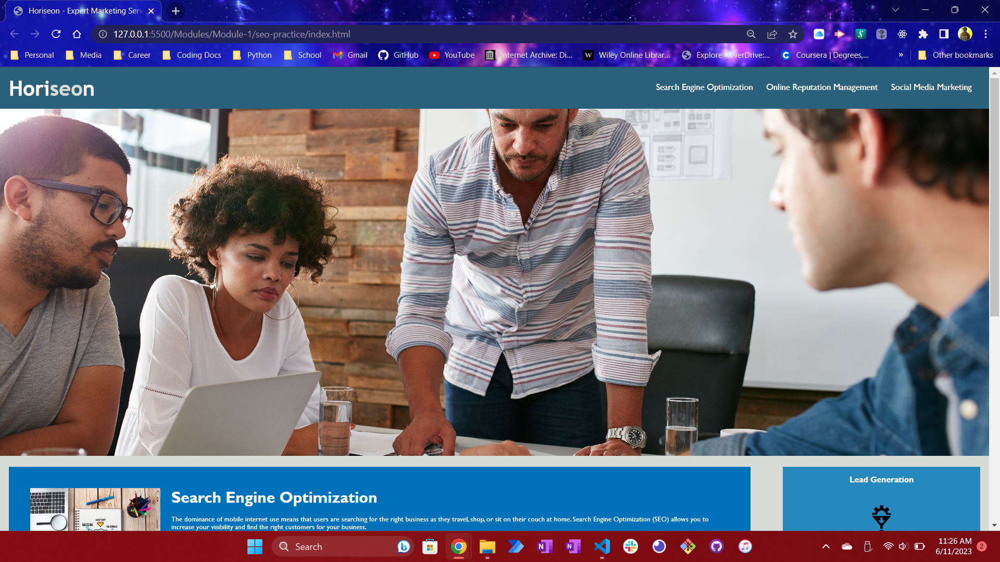

# SEO-practice

## Description
This project is a website for a marketing agency called Horiseon. The primary goal of this project was to refactor the existing codebase to make it more accessible and user-friendly. I have updated the HTML to be more semantic, fixed the broken links, and updated the CSS to reflect the changes made. The end result is a cleaner and more efficient codebase that adheres to accessibility standards, while still maintaining the original functionality and design of the original site. 
## Screenshot

## Link to Deployed Application 
[Link to the project](https://thinker92.github.io/seo-practice/)
